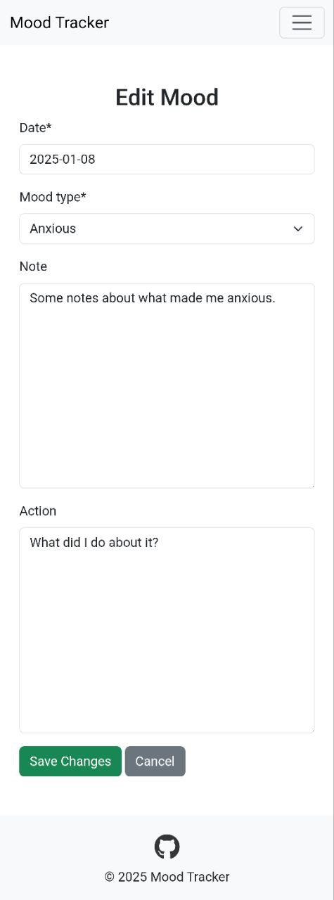
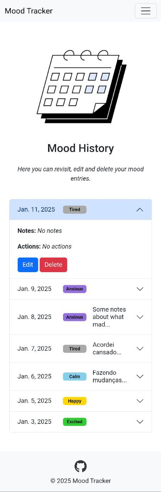
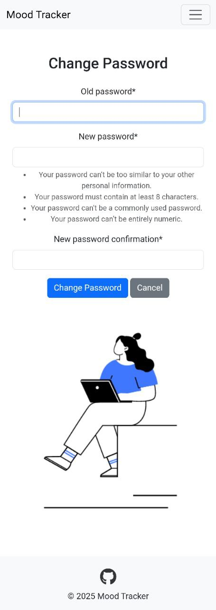
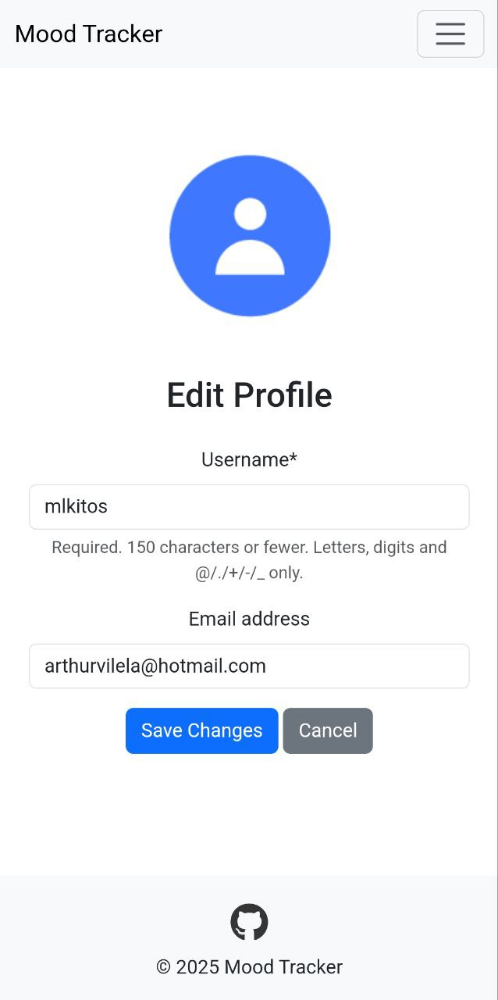

# **Mood Tracker**

> ## Live website: https://pp4-mood-tracker-20082cf10f44.herokuapp.com/


## **Description**
A Django-based web application for tracking moods, allowing users to record their emotional state, actions, and analyze patterns over time.
### Overview

Mood Tracker is a portfolio project developed as part of the Full Stack Development course curriculum from Code Institute. This application was created with the goal of providing a simple, user-friendly tool for individuals to track their emotional responses over time. It offers insights that can help users better understand themselves or serve as a supplemental tool in therapy sessions.

### Motivation

The project theme was free to choose, and I opted for mood tracking because it's a topic close to my heart and an essential one for society. The app aims to empower individuals to log their moods, reflect on past experiences, and foster emotional awareness.

### Target Audience

The application is intended for the general public, particularly individuals seeking to improve their mental health through self-reflection. Users can benefit from a visual overview of their emotional trends and the ability to revisit older entries.
___

## **UX**

### **Wireframes**
Wireframes were created during the planning phase to guide the design and layout of the application.


  

### **Responsive Design**
The application is mobile-friendly and adjusts to different screen sizes to ensure accessibility and usability for a wide range of users.

#### **Implementation**
1. **Frontend**:
   - **Bootstrap Grid System**:  
     The app uses Bootstrap's grid system to ensure consistent layouts across devices, enabling components to adjust dynamically to the screen size.
   - **Media Queries**:  
     Custom media queries provide additional styling for both small and large screens, enhancing the user interface's adaptability.

2. **Integration**:
   - **Navbar**:  
     - Collapses into a hamburger menu on smaller screens for easier navigation.  
     - Expands fully on larger screens for accessibility.  
   - **Forms**:  
     - Inputs, buttons, and text areas are sized appropriately for touch interfaces on mobile devices.  
   - **Tables**:  
     - Adjust column widths and enable horizontal scrolling for smaller screens.

#### **Testing**
The responsive design was thoroughly tested on various devices and browsers to ensure seamless performance:
- **Devices**:
  - Mobile phones (e.g., iPhone, Pixel 7 Pro)
  - Tablets (e.g., Samsumg Galaxy Tab)
  - Desktop computers
- **Browsers**:
  - Google Chrome
  - Mozilla Firefox
  - Safari
  - Microsoft Edge

---

### **User Experience Goals**
The application is designed with the following goals in mind:

1. **Accessibility**:
   - Text is legible on all devices.
   - Buttons and clickable elements are large enough for touch interfaces.
   - Navigation is simple and intuitive.
   - Minimalistic color palette insures great contrast.

2. **Consistency**:
   - Maintain a uniform look and feel across all pages.
   - Responsive layouts ensure the app looks professional on all screen sizes.

3. **Ease of Use**:
   - Ensure forms are easy to complete.
   - Allow users to navigate quickly between different sections (e.g., Dashboard, Settings, Mood History).

4. **Aesthetic Appeal**:
   - Bootstrap aesthetic are simple, but familiar to most users, making navigation through the website more intuitive.
   - Minimalistic design to avoid overwhelming the user.


### Favicon  

The favicon reflects the project's core functionality: a calendar emoji, eluding to the daily task of registering one's day and revisiting it.

  

## **Features**

### **Home Page**
First time users are brought to the home page where they have the option to Sign Up or Log In, if they are not already logged in. 


Authenticated users will see a "Add Mood Entry" button from the home page.


### **Mood Logging**

Users can log daily moods along with optional notes and actions.


From the **Mood History** page, users can edit their previous entries.




#### **Implementation**
1. **Frontend**:
   - The mood entry page provides a user-friendly form where users can:
     - Select their mood from predefined choices (e.g., Happy, Sad, Anxious).
     - Add optional notes and actions to describe their day.
     - Specify the date of the mood entry (defaults to today’s date).
   - The form uses Bootstrap styling for a clean, responsive design.
   - Template file: `mood/templates/mood_entry.html`

2. **Backend**:
   - **Model**:
     - Mood entries are stored in the `Mood` model, which includes:
       - User reference (`ForeignKey` to `AUTH_USER_MODEL`).
       - Mood type (with predefined choices using `TextChoices`).
       - Date, notes, and actions for additional details.
       - Timestamps for creation and updates.


   - **Form**:
     - A custom `MoodEntryForm` validates user input:
       - Ensures dates are within the last two weeks using a custom validator.
       - Provides HTML5 date input and styled textareas for notes/actions.
   - **View**:
     - The `mood_entry_view` handles form submissions:
       - Validates input and associates the entry with the logged-in user.
       - Saves the entry and redirects to the dashboard upon success.
       - Example from `mood/views.py`:

   - **URLs**:
     - The form is accessible via `/mood/entry/`, registered in `mood/urls.py`:

3. **Security**:
   - CSRF protection is implemented using Django’s built-in mechanism.
   - Only logged-in users can access the mood entry page (`@login_required`).

4. **Validation**:
   - Date validation ensures entries are no older than two weeks.
   - Form validation ensures required fields are filled and follow constraints.

---

### **Visual Calendar**
A calendar on the dashboard provides a color-coded overview of logged moods. Since the user can log more than one mood entry per day, the calendar displays matching color of the most common mood that day or, in case there is an equal number of each mood type entries per day, the color of the first logged mood is displayed.

  

  

  

#### **Implementation**
1. **Frontend**:
   - The calendar is dynamically rendered using **D3.js** to display an **SVG** element for each month.
   - Each cell represents a day and is color-coded based on the most frequent mood logged for that day.
   - A legend provides a visual guide for mood colors.

2. **Backend**:
   - A dedicated Django view aggregates mood data by date, determining the most frequent mood per day using Python's `Counter`.
   - The processed data is sent to the frontend as a JSON object.

3. **Integration**:
   - The `dashboard.html` template fetches the JSON data and renders it into the calendar using a JavaScript script.
   - Users can view their mood patterns over time in a responsive and visually appealing way.

---

### **History Review**
Users can revisit older entries through an accordion-style mood history page.

  

  

  


#### **Implementation**
1. **Frontend**:
   - Bootstrap's accordion component is used to create a collapsible interface.
   - Each entry displays the mood type, date, and optional notes or actions.
   - Users can edit or delete entries directly from the history page.

2. **Backend**:
   - A Django view retrieves all moods for the logged-in user, sorted by date in descending order.
   - Pagination or lazy loading is not currently implemented but can be added for performance optimization.

3. **Integration**:
   - The `mood_history.html` template includes modals for delete confirmations.
   - A separate JavaScript file handles interactivity, such as populating the delete modal.

---

### **Dark Mode**
In the **Settings** page, a toggle allows users to switch between light and dark themes.

  

#### **Implementation**
1. **Frontend**:
   - The settings page includes a toggle switch for enabling or disabling dark mode.
   - CSS classes are applied dynamically to templates based on user preferences.

2. **Backend**:
   - The `UserPreferences` model stores the dark mode preference for each user.
   - The `settings_view` updates the preference based on form input and sets a session variable to persist the preference.

3. **Integration**:
   - Dark mode applies to all key components, including the navbar, content sections, and footer.
   - The theme persists across sessions, ensuring a consistent user experience.

---

### **Daily Reminder Email Feature**

  


#### **Overview**
The Daily Reminder Email feature ensures that users who opt-in receive a notification email at 20:00 UTC, reminding them to log their mood in the app. This feature is designed to help users maintain consistent mood tracking and make the most of the app's functionality.

  

  

---

#### **Feature Implementation**

1. **Opt-In Settings**:
   - Users can enable or disable email notifications through the **Settings** page.
   - The notification preferences are stored in the `NotificationSettings` model with the field `notify_by_email`.

2. **Email Content**:
   - The email contains a friendly reminder message:
     ```
     Subject: Mood Tracker Reminder
     Message: This is your daily reminder to log your mood in the Mood Tracker app!
     ```

3. **Automated Task**:
   - A custom Django management command, `send_reminders`, is responsible for sending the emails.
   - The command:
     - Queries the database for users with `notify_by_email=True`.
     - Sends reminder emails to the listed users using Django's `send_mail()` function.

4. **Endpoint for Automation**:
   - A secure endpoint (`/dashboard/send-reminders/`) allows external schedulers to trigger the reminder emails.
   - This endpoint:
     - Requires a secret token (`X-SECRET-TOKEN`) for authentication.
     - Executes the `send_reminders` command when accessed via a POST request.

5. **Automation with GitHub Actions**:
   - A GitHub Actions workflow triggers the `/dashboard/send-reminders/` endpoint daily at 20:00.
   - The workflow uses a secure `SECRET_TOKEN` stored in the repository's secrets to authenticate the request.

---

### **User Profile Management**

From the **Settings** page, users can click on a link to **change password** or **update profile**. The user is then taken to the respective page where they update their account information.

  

  

  

  


#### **Implementation**
1. **Frontend**:
   - Profile update forms include fields for editing the username and email, along with secure fields for password changes.
   - Bootstrap styling ensures a clean and responsive user interface.

2. **Backend**:
   - Profile updates are managed by Django Allauth, leveraging its built-in functionality for authentication and user account management.
   - Passwords are securely hashed and validated using Django's authentication tools.

3. **Integration**:
   - Notifications confirm successful updates to the user's profile.
   - The updated information is immediately reflected in the user session.


### **Admin Page**

The project utilizes Django's built-in Admin Page for efficient management of users and mood entries. This powerful tool provides an intuitive interface for superusers, allowing them to oversee and control key aspects of the application.

**Key Features:**
  
  Access Control:

  - Only a superuser can access the Admin Page, ensuring secure management of data.
  - Superusers authenticate with a username and password.
  
  User Management:

  - View, delete, or deactivate users.
  - Passwords remain secure; superusers cannot view or edit them.

  Mood Entry Management:

  - Add, edit, or delete mood entries.
  - Filter by date, user, or mood type, and order entries for better organization.

  Filter and Search:

  - Built-in filters and search capabilities make it easy to locate specific users or entries.
   
  Customization:

  - Key fields like user, mood type, and date are displayed in the list view.
  - Additional admin features include search and filter options for mood type, date, and notes.
  
  Security:
  
  - Accessible only via /admin/, protected by Django's authentication system.
  - Sensitive operations are logged for transparency.

  

  

---

## **Agile Development Process**

### Project Management
The development followed an Agile methodology with:

- **`Epics`** - Each Epic was defined as a broad function. They were created using GitHub's Milestone function to attach them to user stories and track development.

  

- `User Stories`: Created for all features, detailing Epics into concrete completion criteria.

  - Stories had different priority level, similar to MoSCoW method, with `must-have`,`should-have`, `could-have`. There were no `won't-have` labelled user stories in this project.
  - Stories had defined acceptance criteria to fulfill the story either from an Admin or User perspective.

  


- `Kanban Board`: Managed tasks, priorities, and timelines on GitHub Projects.

  

### Epics and User Stories
Each Epic was defined as a broad function and separated into to well-defined user stories:

- #### **Epic: User Account Features**
   *Purpose:*  Create, edit and control user account and its configuration.
   Group all features related to user account creation, authentication, and management.

   - **User Story**: As a _site user_, I can _register, log in, and log out_ so that I can _securely access my account._

      Acceptance Criteria:
      - AC1: The user can register with a username, email, and password.
      - AC2: The user can log in with valid credentials and log out at any time.
      - AC3: The site restricts access to authenticated users for private content.

    - **User Story**: As a _site user_, I can _update my profile information_ so that _I can keep my details current._

      Acceptance Criteria:
      - AC1: The user can edit their username and email.
      - AC2: The user can change their password through a secure form.
      - AC3: Changes are saved and reflected immediately.

   - **User story** - As a _site user_, I can _enable or disable dark mode_ so that I can _customize the website's appearance_.

      Acceptance criteria: 
      - AC1: The settings page provides a toggle for enabling or disabling dark mode.
      - AC2: Changes to dark mode are applied immediately without refreshing the page.
      - AC3: My preference is saved and remembered for future visits.
   
   - **User Story**: As a _site user_, I can _configure notification preferences_ so that I can _receive daily reminders to log my mood_.

      Acceptance Criteria:
      - AC1: The user can enable or disable email notifications.
      - AC2: The system saves and reflects the updated settings on the dashboard.
      - AC3: A reminder email is sent daily at 20:00 UTC if the user has enabled email notifications


- #### **Epic: Mood Tracking Features**
   *Purpose:* User can log their mood.

   - **User Story**: As a _site user_, I can _log a new mood entry_ so that I can _track my daily emotions and notes_.

      Acceptance Criteria:
      - AC1: The user fills in a form to select a mood type, add a date, and optional notes or actions.
      - AC2: The system validates the form and saves the mood entry to the database.
      - AC3: The user receives a confirmation message upon successful save.

   - **User Story**: As a _site user,_ I can _edit a mood entry_ so that I can _correct or update past data_.

      Acceptance Criteria:
      - AC1: The user can access an edit form pre-filled with the mood entry details.
      - AC2: The system validates and updates the entry upon submission.
      - AC3: Changes are reflected in the mood history and charts.

   - **User Story**: As a _site user_, I can _delete a mood entry_ so that I can _remove incorrect or unnecessary data_.

      Acceptance Criteria:
      - AC1: The user confirms the deletion through a prompt.
      - AC2: The system deletes the mood entry and updates the database.
      - AC3: The deletion is reflected in the mood history and charts.

- #### **Epic: Dashboard Features**
   User can view their mood history on a calendar to identify trends.

   - **User Story**: As a _site user_, I can _view my mood history_ so that I can _reflect on my mood patterns over time_.

      Acceptance Criteria:
      - AC1: The user sees a list of their mood entries ordered by date.
      - AC2: Each mood entry displays the mood type, date, and any notes added.
      - AC3: The user can click on an entry to edit or delete it.

   - **User Story**: As a _site user_, I can _view visualized charts of my mood data_ so that I can _better understand trends and patterns_.

      Acceptance Criteria:
      - AC1: The chart displays mood types over time on a calendar like graph.
      - AC2: The chart includes a legend for mood types.
      - AC3: The chart dynamically updates as the user adds, edits, or deletes mood entries.
      User Story: As a _site user_, I can _configure notification preferences_ so that I can _receive daily reminders to log my mood_.


- #### **Epic: Admin Features**
   As an administrator, I can manage users and their mood entries.

   - **User Story**: As an _admin user_, I can _manage user accounts_ so that I can _resolve issues or moderate the platform_.

      Acceptance Criteria:
      - AC1: The admin can view a list of all user accounts.
      - AC2: The admin can edit or deactivate a user account.
      - AC3: The admin cannot view or edit user passwords.

   - **User Story**: As an _admin user_, I can _view and manage mood entries_ so that I can _moderate content and maintain data integrity._

      Acceptance Criteria:
      - AC1: The admin can view all mood entries across users.
      - AC2: The admin can delete inappropriate or duplicate entries.
      - AC3: Changes made by the admin are logged for accountability.

## **Models**

### ERD


### User Model
Purpose: Extends the Django authentication system, enabling user management for the platform.

#### Fields
Inherits fields like username, email, and password from Django’s built-in User model.
| Field | Description |
|-------|-------------|
|`user` | Primary key, identifying each single user.|
|`email`| Email field storing users email for notification |
|`password`| Storing user created password unavailable to Admin

Additional fields or methods could include custom validation or integration with related models.

### Mood Model

The Mood model represents user-submitted mood entries and includes fields to capture details about their emotional state on specific dates. This model allows users to document their feelings, actions taken, and additional notes for reflection or tracking purposes.

#### Fields
| Field | Description |
|-------|-------------|
| `user`| A foreign key linking the mood entry to a registered user.|
|`date`| The date on which the mood was recorded.|
|`mood_type`| A choice field representing predefined mood types (e.g., Happy, Sad, Angry).|
|`note`| Optional text field for additional comments about the mood.|
|`action`| Optional text field to document actions taken to manage the mood.|
|`created_at`| The timestamp when the mood entry was created (automatically generated).|
|`updated_at`| The timestamp when the mood entry was last updated (automatically generated).|

#### Validation

The `mood_type` field restricts entries to predefined choices to maintain data integrity.
Admin Panel Features
The model is registered in the Django admin panel with the following enhancements:
- Search Fields: user and note for quick lookup.
- Filter Options: mood_type and date for targeted filtering.
- Display Configuration: Shows user, date, mood_type, and created_at for each entry.

### Notification Settings Model

Purpose: Manages user preferences for email notifications, allowing users to toggle reminders for mood logging and specify the notification time.

> Due to time and skill limitations, the previous idea of having the user select their preferred time for receiveing the email reminder was discarded. The Notification Settings model was already created at that point, with the `notify_time` field responsible for storing the user specified notification time. To avoid migration issues and to keep the possibility for future implementation of this feature, the `notify_time` was left in the model, although not used in the project at the moment.

#### Fields

| Field | Description |
|-------|-------------|
|`user` | Links notification settings to a specific user.|
|`notify_by_email` | Boolean indicating if reminders are enabled.|
|`notify_time`| Specifies the time for sending notifications.|

### User Preferences Model

Purpose: Tracks user preferences for application settings, such as enabling dark mode for the user interface.

#### Fields
| Field | Description |
|-------|-------------|
|`user` | Links preferences to a specific user.|
|`dark_mode_enabled`| Boolean indicating if dark mode is active.|

## **Testing**

The project includes automated tests to ensure the functionality of all key features, including user authentication, mood tracking, and notification settings. Comprehensive tests were written for models, views, forms, and JavaScript functionality. The application has been tested manually and through automation to ensure robustness and a seamless user experience.

---

### **Key Areas Covered**

#### **1. Model Tests**
- Verified the correctness of model behavior and string representations for:
  - **Mood**:
    - Test for mood creation with all fields (e.g., mood type, note, action).
    - Validated `__str__` representation for user-friendly display.
  - **NotificationSettings**:
    - Ensured correct default behavior for notification preferences.
    - Verified proper handling of notification times.
  - **UserPreferences**:
    - Tested dark mode toggle functionality.
    - Checked `__str__` representation reflects dark mode status.

#### **2. View Tests**

##### **Dashboard Views**

- **Mood Calendar**:
  - Tested that the calendar view returns JSON with correct labels and data for moods.
  - Verified handling of no moods and invalid mood types.
  - Checked that unauthenticated users are redirected to the login page.

- **Mood History**:
  - Ensured the mood history page loads correctly with the appropriate template.
  - Verified that moods are displayed correctly, including all attributes (e.g., mood type, date).

- **Notification Settings**:
  - Tested updating notification preferences through the settings page.
  - Ensured users can enable/disable notifications and set a preferred notification time.

##### **User Management Views**

- **Logout Confirmation**:
  - Confirmed the logout confirmation page renders correctly.
  - Verified that users are logged out and redirected to the home page.

- **Profile Update**:
  - Tested the profile update form pre-populates with user data (username, email).
  - Validated updates to username and email are saved and reflected immediately.

- **Password Change**:
  - Verified successful password changes with valid data.
  - Tested error handling for invalid old passwords and mismatched new passwords.

#### **3. JavaScript Tests**
JavaScript functionality was tested using Jest to ensure interactive elements perform as expected:

- **Timeout Messages**:
  - Verified alert messages are removed from the DOM after 5 seconds.

- **Modal Data Handling**:
  - Ensured the `edit` and `delete` modals are populated with correct data from user actions.

---

### **Feature-to-Test Mapping**

This subsection links the project's core features to their respective automated and manual tests, ensuring comprehensive coverage of functionality.


#### **1. Feature: Mood Logging**
**Description**: Users can log daily moods, including optional notes and actions, and specify a date.

- **Automated Tests**:
  - **Model Tests**:
    - Verified mood creation, including the correct assignment of user, mood type, date, notes, and actions.
    - Ensured timestamps (`created_at`, `updated_at`) are automatically generated.
    - Validated `__str__` representation reflects the user's mood and date.
  - **View Tests**:
    - Tested the mood entry view to ensure only authenticated users can access the page.
    - Checked form validation for required fields, date limits (no older than two weeks), and invalid mood types.
  - **Form Tests**:
    - Validated that the `MoodEntryForm` correctly applies custom validators for date inputs.
    - Ensured the form handles optional fields (notes, actions) appropriately.

- **Edge Cases**:
  - Form submission with invalid mood types or missing required fields.
  - Form submissions with dates outside the allowed range.

- **Manual Testing**:
  - Verified that the mood logging form renders correctly and saves data to the database.
  - Checked that invalid inputs trigger appropriate error messages.
  - Tested usability across devices (desktop, mobile, tablet).

---

#### **2. Feature: Visual Calendar**
**Description**: Displays a color-coded calendar of logged moods to visualize patterns over time.

- **Automated Tests**:
  - **View Tests**:
    - Verified that the mood calendar endpoint returns the correct JSON structure (`labels`, `data`).
    - Ensured the view handles well cases with no mood entries.
    - Tested that only authenticated users can access the calendar data.
  - **JavaScript Tests**:
    - Checked that the D3.js script renders the calendar dynamically based on the JSON data.
    - Verified the correct colors are applied for each mood type using test data.

- **Edge Cases**:
  - Empty data sets (no moods logged).
  - Invalid mood types included in the data.

- **Manual Testing**:
  - Observed the rendering of the calendar for different months and mood data sets.
  - Checked that calendar elements are responsive and visually accurate across devices and browsers.

---

#### **3. Feature: History Review**
**Description**: Allows users to revisit, edit, or delete past mood entries.

- **Automated Tests**:
  - **View Tests**:
    - Tested that the history view fetches and displays moods sorted by date in descending order.
    - Checked that the correct template is rendered.
    - Verified only authenticated users can access the mood history page.
  - **JavaScript Tests**:
    - Ensured the `delete` and `edit` modals populate with the correct mood data.
    - Tested that modal interactions function as expected.

- **Edge Cases**:
  - Deleting a mood entry that no longer exists (simulated by another user’s action).
  - Editing an entry with invalid data.

- **Manual Testing**:
  - Tested the responsiveness and functionality of the accordion component.
  - Checked the integration of modals for editing and deleting entries.

---

#### **4. Feature: Dark Mode**
**Description**: Allows users to toggle between light and dark themes.

- **Automated Tests**:
  - **Model Tests**:
    - Verified that the `UserPreferences` model stores and retrieves the `dark_mode_enabled` value correctly.
  - **View Tests**:
    - Tested the settings view to ensure user preferences are updated on form submission.
    - Verified the dark mode toggle affects the session and persists across requests.

- **Edge Cases**:
  - Session expiration during dark mode toggle.
  - Simulated user preference conflicts (e.g., two devices updating settings simultaneously).

- **Manual Testing**:
  - Observed the application’s appearance in light and dark modes.
  - Verified that theme preferences persist across logins and devices.

---

#### **5. Feature: Daily Reminder Email**
**Description**: Sends email notifications to users who opt-in for daily reminders.

- **Automated Tests**:
  - **Model Tests**:
    - Verified the default values of `NotificationSettings` (e.g., `notify_by_email`).
  - **View Tests**:
    - Tested the email reminders endpoint to ensure it triggers correctly with valid tokens.
    - Checked that reminders are sent only to users with notifications enabled.

- **Edge Cases**:
  - Invalid email configurations (e.g., missing SMTP credentials).
  - Database errors during the reminder query.

- **Manual Testing**:
  - Verified the email content and formatting.
  - Checked that opt-in users receive emails at the specified time.

---

### **Test Results**

#### **Automated Python Tests**
- **Command**: `python manage.py test`

  

#### **Automated JavaScript Tests**
- **Command**: `npx jest`

  


#### **Edge Case Tests**
- **Examples**:
  - Placeholder: Include screenshots or logs for tests that handle invalid inputs, unauthorized access, or other edge cases.

---


### Manual Testing
In addition to automated tests, manual testing was conducted to verify:

#### **Functional Tests**

| **Test**                                   | **Action**                                                                 | **Expected Result**                                                                                      | **Outcome** |
|--------------------------------------------|----------------------------------------------------------------------------|----------------------------------------------------------------------------------------------------------|-------------|
| User can log a new mood entry              | Open the "Add Mood Entry" page, fill out the form, and submit               | Mood entry is saved and appears on the dashboard and history pages                                      | Pass        |
| User can edit a mood entry                 | Open an existing entry and edit the mood type or notes                     | Changes are saved and updated in the dashboard and history views                                        | Pass        |
| User can delete a mood entry               | Select a mood entry and delete it                                          | Entry is removed from the dashboard and history views                                                   | Pass        |
| Calendar displays color-coded mood data    | Navigate to the dashboard with logged mood entries                         | The calendar displays the most common mood for each day, color-coded appropriately                       | Pass        |
| Notification settings can be toggled       | Enable or disable email notifications from the settings page               | Notifications toggle is saved, and behavior reflects the preference                                     | Pass        |
| Email reminders are sent to opted-in users | Enable notifications and wait for the reminder email                      | Reminder email is received at the expected time                                                         | Pass        |
| Dark mode toggles successfully             | Enable or disable dark mode from the settings page                         | Website updates its theme to dark or light based on the toggle                                          | Pass        |
| Password change functionality              | Change password using the "Change Password" form                           | Password is updated, and the user can log in with the new password                                       | Pass        |
| Profile update functionality               | Update the username or email on the profile page                           | Changes are saved and reflected on the user's account                                                   | Pass        |

---

#### **Responsiveness Tests**

| **Test**                                   | **Action**                                                                 | **Expected Result**                                                                                      | **Outcome** |
|--------------------------------------------|----------------------------------------------------------------------------|----------------------------------------------------------------------------------------------------------|-------------|
| Layout consistency on different resolutions | Use browser DevTools to test layouts on various screen sizes               | Layout remains functional and visually appealing on all screen sizes                                    | Pass        |
| Mobile responsiveness                      | Test the site on a mobile device                                           | Layout adjusts to fit the smaller screen without losing usability                                       | Pass        |
| Navbar collapses into a hamburger menu     | Resize the browser to simulate a smaller screen                            | Navbar collapses into a responsive hamburger menu                                                       | Pass        |

---

#### **Accessibility Tests**

| **Test**                                   | **Action**                                                                 | **Expected Result**                                                                                      | **Outcome** |
|--------------------------------------------|----------------------------------------------------------------------------|----------------------------------------------------------------------------------------------------------|-------------|
| Keyboard navigation                        | Use the Tab key to navigate through all interactive elements               | All focusable elements are accessible, and navigation order is logical                                  | Pass        |
| Forms display validation messages          | Submit forms with invalid or empty required fields                         | Validation messages appear clearly for all issues (e.g., invalid email, missing required fields)        | Pass        |
| Error message clarity                      | Trigger an error (e.g., incorrect login or invalid form submission)         | Error message clearly explains the issue and how to fix it                                              | Pass        |
| Large text mode compatibility              | Increase the font size in browser settings                                 | Content scales appropriately without breaking the layout                                                | Pass        |

---

#### **User Flow Tests**

| **Test**                                   | **Action**                                                                 | **Expected Result**                                                                                      | **Outcome** |
|--------------------------------------------|----------------------------------------------------------------------------|----------------------------------------------------------------------------------------------------------|-------------|
| New user registration                      | Complete the sign-up form and log in                                       | Account is successfully created, and user is redirected to the dashboard                                | Pass        |
| Existing user login                        | Log in using valid credentials                                             | User is logged in and redirected to the dashboard                                                       | Pass        |
| Incorrect login displays error             | Attempt to log in with invalid credentials                                 | Error message is displayed prompting the user to check their details                                    | Pass        |
| Logout redirects to the homepage           | Log out from the application                                               | User is redirected to the homepage                                                                      | Pass        |


### Validator testing

#### HTML W3C Validator

  

  - No errors or warnings shown.
  - Input in validation tool was done via direct text input, copied from the page's source code due to Django's template language not being recognized by W3C HTML Validator

#### CSS W3C Validator


- No errors found.
- <p>
    <a href="http://jigsaw.w3.org/css-validator/check/referer">
        
    </a>
</p>

#### JSHint

- No errors were shown, but the script responsible for the calendar uses external information from D3js, and causes an undefined variable.

- `mood_history.js`

  

- `mood_calendar.js`

  

#### **Lighthouse**

- Lighthouse in devtools indicated a high Accessibility, Best Practices and SEO scores.
- Performance scores varied when analysing  the `mobile` or `desktop` versions. Although the website is clean, with almost no large pictures, the loading times for the JavaScript `scripts` were long, including D3.js, Bootstra and the custom ones.

- **Mobile**

  

- **Desktop**

  

#### Browsers Tested

- Google Chrome (Desktop & Mobile)
- Mozilla Firefox
- Safari (iPhone & Mac)
 
#### Devices Tested
- Desktop (Windows, macOS)
- Mobile (Android, iOS)
- Tablets (iPad)

### Future Enhancements

- Increase test coverage for edge cases, such as network failures and invalid input formats.
- Automate browser testing with tools like Selenium or Cypress.
- Add performance testing for large datasets, particularly for calendar and history views.

---

## **Security**

Ensuring the security of user data and the application’s integrity is a top priority for Mood Tracker. This section outlines the measures implemented to protect sensitive information and secure the platform against potential vulnerabilities.

### **1. CSRF Protection**

  - Django’s built-in **CSRF (Cross-Site Request Forgery)** protection is enabled across all POST requests.
  - CSRF tokens are included in forms and validated on the server to prevent unauthorized actions.
  - Example: CSRF token was included in all forms, such as the `mood-entry` form:

    ```html
    <form method="POST" class="mt-4">
          
          {{ form.as_p }}
          <button type="submit" class="btn btn-primary btn-block">Submit</button>
          <a href="" class="btn btn-secondary w-45">Cancel</a>
      </form>
    ```

---

### **2. Secret Key Management**

  - The `SECRET_KEY` is securely stored in an environment variable and is never exposed in the project repository.
  - The application relies on this key for cryptographic operations.
  - The `SECRET_KEY` was added to the environment in deployment via Heroku Config Vars.

---

### **3. Sensitive Data Exclusion and Environment Variables**

  - Sensitive information such as email credentials (`EMAIL_USER` and `EMAIL_PASSWORD`), database configuration, and the `SECRET_KEY` is stored in environment variables.
  - These variables are loaded at runtime and are not included in the source code.
  - `.env` or `env.py` files containing environmental variables are used locally and securely excluded from version control.
  - The variables in those files were added to the environment in deployment via Heroku Config Vars.
  - Sensitive files (e.g., `.env`, `env.py`) are excluded from the Git repository using `.gitignore`.
  - The repository contains no hardcoded credentials or keys.

---

### **4. HTTPS and Secure Connections**

  - The application is deployed on Heroku with **HTTPS enforced** for all connections.
  - Secure transmission ensures that user data is encrypted during communication between the client and server.
    ```
    https://pp4-mood-tracker-20082cf10f44.herokuapp.com/
    ```

---

### **5. Authentication and Password Security**

  - User passwords are stored in the database using Django’s default **PBKDF2 password hashing** mechanism.
  - Django Allauth manages user authentication, ensuring robust security for login and registration processes.
  - Django Allauth includes the following password restrictions:
      - Your password can’t be too similar to your other personal information.
      - Your password must contain at least 8 characters.
      - Your password can’t be a commonly used password.
      - Your password can’t be entirely numeric.

---

### **Future Enhancements**

  - I consider implementing additional security measures, such as:
    - Multi-factor authentication for user accounts.
    - Additional validation layers for email notifications and user inputs.


## **Bugs**

Below are the known bugs and issues encountered during the project development, along with their resolutions:

| **Bug**                                         | **Issue**                                                                                                                                                           | **Cause**                                                                                                  | **Resolution**                                                                                                                                      |
|-------------------------------------------------|-------------------------------------------------------------------------------------------------------------------------------------------------------------------|------------------------------------------------------------------------------------------------------------|------------------------------------------------------------------------------------------------------------------------------------------------------|
| **Dark Mode Partially Applied After Logging Back In** | After logging out with dark mode enabled, logging back in caused the website to display a partially applied dark theme. The settings page form remained white.    | `dark_theme` preference was not properly synced between the session and the database during login.         | Implemented a middleware to synchronize the `dark_theme` preference with the session during every user request.                                      |
| **"Successfully Logged In" Message Appears on Settings Page** | The "Successfully logged in" message was displayed on the settings page when it was first opened in a session.                                                    | Django's `messages` framework carried over the login success message to subsequent views.                  | Cleared all messages in the settings view before rendering the page.                                                                                 |
| **Reverse URL Not Found During Tests**          | Several tests failed with the error `NoReverseMatch: Reverse for 'mood_chart' not found`.                                                                         | Missing `mood_chart` and `notification_settings` routes in `urls.py`.                                     | Added the missing URL patterns to `dashboard/urls.py`.                                                                                               |
| **Custom User Model Not Recognized in Tests**   | Tests failed with the error `AttributeError: Manager isn't available; 'auth.User' has been swapped for 'users.CustomUser'`.                                       | Tests referenced the default `User` model instead of the custom `CustomUser`.                             | Updated tests to use `get_user_model()` to dynamically fetch the correct user model.                                                                 |
| **JavaScript Error on Dashboard for Missing Modal** | A `TypeError: Cannot read properties of null (reading 'addEventListener')` error occurred on pages where the modal element did not exist.                         | The JavaScript code assumed the modal always existed, leading to errors on pages without it.              | Added a null check for modal-related elements before attaching event listeners.                                                                       |
| **Alert Messages Timeout Not Working Consistently** | The timeout for dismissing alert messages after 5 seconds worked during manual testing but failed in automated tests.                                             | The test environment did not properly simulate the DOM and `setTimeout` behavior.                          | Installed `jest-environment-jsdom` and rewrote tests using `jest.useFakeTimers()` to simulate the timeout.                                           |
| **Error When Running Heroku Scheduler for Notifications** | The Heroku Scheduler triggered notification jobs successfully but was restricted to 10-minute intervals, preventing user-specific notification times.              | Scheduler limitations in Heroku's free tier.                                                              | Standardized notifications to be sent at a fixed time (8:00 PM) for all users.                                                                       |
| **Email Reminder Not Sending**                  | Emails were not being sent despite the Heroku Scheduler being configured correctly.                                                                                | The `send_reminders` management command lacked an `os` import for fetching environment variables.          | Added the `import os` statement to the `send_reminders.py` file.                                                                                     |
| **Calendar Colors Not Rendering**               | The mood calendar displayed blank cells instead of color-coded days after modifications to the `mood_calendar_view`.                                              | Changes to the JSON response format broke the D3.js script that rendered the calendar.                     | Reverted the `mood_calendar_view` to its previous working format to maintain compatibility with the frontend script.                                  |
| **Lighthouse SEO Score**                        | The Lighthouse tool flagged the site for missing meta descriptions, resulting in an SEO score of 90.                                                              | The `<head>` section of the `base.html` template did not include a meta description.                       | Added a `<meta name="description" content="A mood tracking application for recording and analyzing emotional patterns.">` tag to the `<head>` section. |
| **CSRF Token Missing in JavaScript**            | An unauthenticated user opening the homepage encountered a console error: `SyntaxError: Unexpected token '<', "<!DOCTYPE "... is not valid JSON`.                  | The JavaScript file responsible for fetching data from `/dashboard/mood-calendar/` was not handling unauthenticated requests properly.            | Wrapped the fetch logic in a try-catch block and added an error handler to redirect users to the login page if the request fails.                    |
| **Form Disappearing with `crispy` Filter**      | Applying the `crispy` filter to `{{ form.as_p }}` in the mood entry template caused the form to disappear.                                                        | The `crispy` template tag was not correctly applied to the form.                                           | Updated the form to use `{{ form|crispy }}` instead of `{{ form.as_p }}` for rendering.                                                               |
| **Test Failures Due to View and URL Changes**   | Tests failed due to outdated view and URL names after updates to the application.                                                                                 | View names in `reverse()` calls and URL configurations were not updated in test files.                     | Updated test cases to match the current view and URL names.                                                                                           |
| **Notification Settings Test Failing**          | A test for the notification settings feature failed due to the unused `notify_time` field in the `NotificationSettings` model.                                     | The test was asserting the value of `notify_time`, which is not implemented in the current project.        | Modified the test to validate only the `notify_by_email` field.                                                                                      |
| **Calendar Fetch Error for Unauthenticated Users** | An unauthenticated user opening the homepage encountered a fetch error when the calendar tried to load.                                                           | The `/dashboard/mood-calendar/` endpoint required authentication, causing the fetch request to fail.       | Added a check to ensure calendar data is fetched only for authenticated users and redirected unauthenticated users to the login page.                |
| **JSHint Undefined Variable Warnings**          | JSHint flagged warnings for undefined variables when analyzing the `mood_calendar.js` script.                                                                     | The script used D3.js, which is loaded from an external source, and JSHint could not recognize its context. | Updated JSHint configuration to ignore D3.js-related warnings during linting.                                                                        |


## **Technologies Used**

| Technology                                          | Use                                                                                                           |
|-----------------------------------------------------|---------------------------------------------------------------------------------------------------------------|
| HTML                                                | Structure the webpage.                                                                                        |
| CSS                                                 | Style and add layout to the project.                                                                          |
| JavaScript                                          | Make the website interactive.                                                                                 |
| Django                                              | A Python-based web framework used to develop the backend, manage server-side logic, and handle routing.       |
| [Heroku](https://www.heroku.com/)                   | Cloud platform used for deploying, managing, and hosting the live version of the website.                     |
| [GitHub](https://github.com/)                       | Version control platform used to store the project’s repository, collaborate on code, and manage deployments. |  
| [dbdiagram.io](https://dbdiagram.io/home)           | ERD creation                                                                                                  |
| [Jest](https://jestjs.io/)                          | Unit testing JavaScript functions                                                                             |
| [D3js](https://d3js.org/)                           | Rendering the calendar                                                                                        |
| [RandomKeygen](https://randomkeygen.com/)           | Generating secure random keys                                                                                 |
| [ChatGPT](https://chatgpt.com/)                     | Used for analysing logs and error messages, improving documentation, and brainstorming project ideas.         |
| [Favicon.io](https://favicon.io/favicon-converter/) | Create favicon files.                                                                                         |
| [Balsamiq](https://balsamiq.com/)                   | Used to create wireframes and design the structure of the website.                                            | 

### Backend Optimizations

#### Database Query Efficiency:

- **Optimization**: Utilized Django's ``select_related`` method to minimize redundant database queries for related models.

- **Example**: When fetching user moods for the calendar and history views, related user objects are preloaded to avoid repeated queries.

  ```python
  moods = Mood.objects.select_related('user').filter(user=request.user)
  ```

### Frontend Optimizations

#### Asynchronous Data Fetching:

- **Optimization**: Used asynchronous JavaScript `fetch()` to load mood data for the calendar dynamically, ensuring the page loads quickly without waiting for the data.

  ```javascript
  fetch("/dashboard/mood-calendar/")
      .then((response) => response.json())
      .then((data) => {
          // Render the calendar
      });
  ```

## **Deployment to Heroku**

 Go to Heroku.com and implement the following steps in this order:
 1. On the home page, click 'New' and in the dropdown, click on 'Create a new app'.
 2. Add app name (This name must be unique, and have all lower case letters. Also use minus/dash signs instead of spaces.)
 3. Select Region (Most likely to be Europe)
 4. Click the button that says 'Create App' and name the app. Follow instructions on the screen.
 5. Click on the Deploy tab near the top of the screen.
 6. Where is says Deployment Method click on Github.
 7. Below that, search for your repo name and add that.
 8. Click connect to the app.

 Before clicking below on enable automatic deployment do the following:
 1. Click on the settings tab
 2. Click on reveal config vars.
 3. Add in your variables from your env. files as the key-value pairs.
 4. Go back and click on the Deploy tab. 
 
 Before the app can be connected, push the following new files below to the repository. Go back in the terminal in your coding environment and add the following:
 1. git status
 2. git add requirements.txt
 3. git commit -m "Add requirements.txt file"
 4. git add a Procfile (web: gunicorn _projectname_.wsgi)
 1. git commit -m "Add Procfile"
 2. git push

 Head back over to Heroku where the Deploy tab is.
 1. Click Deploy Branch. (Should be a main or master branch)
 2. Heroku will receive code from Github and build app with the required packages. Hopefully once done the 'App has successfully been deployed message below' will appear.. 
 3. Once you know deployment is successful then click 'Enable Automatic Deploys'
 4. Click 'View' to launch the new app.
 5. Link to deployed site is: https://pp4-mood-tracker-9f61d134c09f.herokuapp.com/

## **Setup**

Follow these steps to set up and run the project in Gitpod:

### 1. Open the Repository in Gitpod
- Navigate to the repository on GitHub.
- Click the **Gitpod** button (or prepend `https://gitpod.io/#` to the repository URL) to open the workspace.

### 2. Install Dependencies
Run the following command in the Gitpod terminal to install all required Python packages:
```bash
pip install -r requirements.txt
```

### 3. Run Migrations
Apply the databse migrations to set up the development database:
```
python manage.py makemigrations
python manage.py migrate
```

### 4. Start the Development Server
```
python manage.py runserver
```
The application will be accessible on port `8000` at:
`https://<workspace-url>/8000`

## **Credits**

[Bootstrap Studio](https://forum.bootstrapstudio.io/) | Tips and problems solving with Bootstrap styling.

[Python Academy](https://pythonacademy.com.br/blog/como-criar-middlewares-no-django) | Instructions to create the middleware that solved the issue with dark theme not being fully applied on login.

[Stack Overflow](https://stackoverflow.com/) | Solved several doubts regarding Django views, Bootstrap customization, and testing.

[ChatGPT](https://chatgpt.com/) | Helped me understand several terminal outputs and debug messages, beyond helping with Readme styling and organization.

[Start Bootstrap](https://startbootstrap.com/theme/personal) | The home page layout was based on this **Start Bootstrap** template.